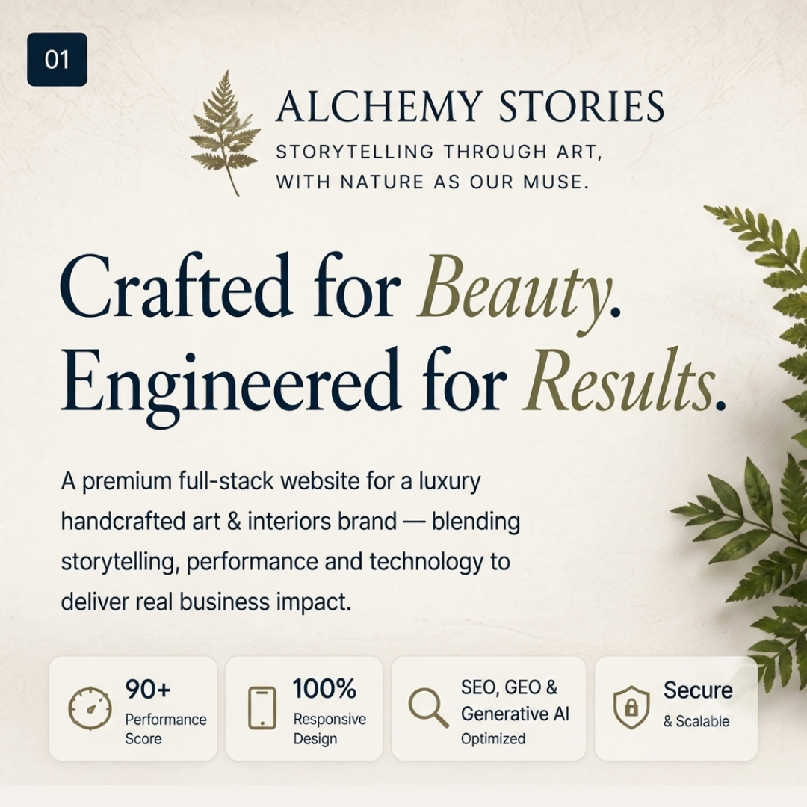
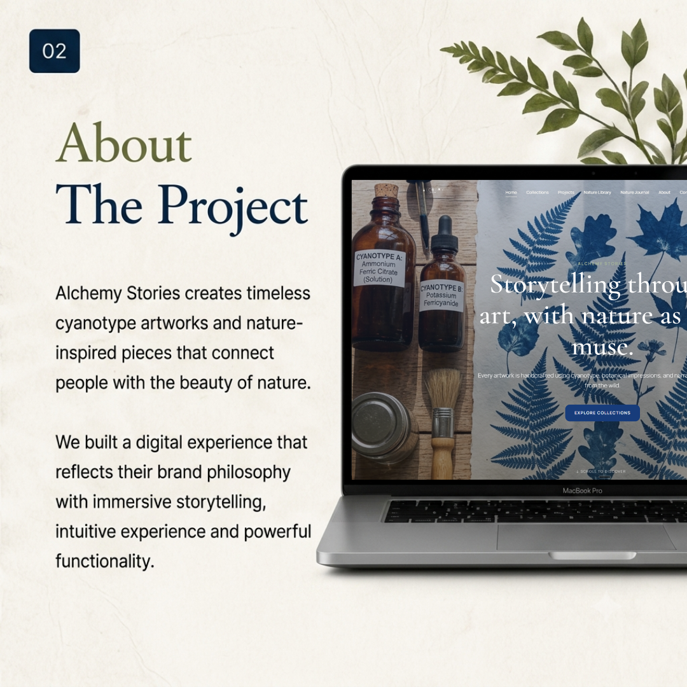
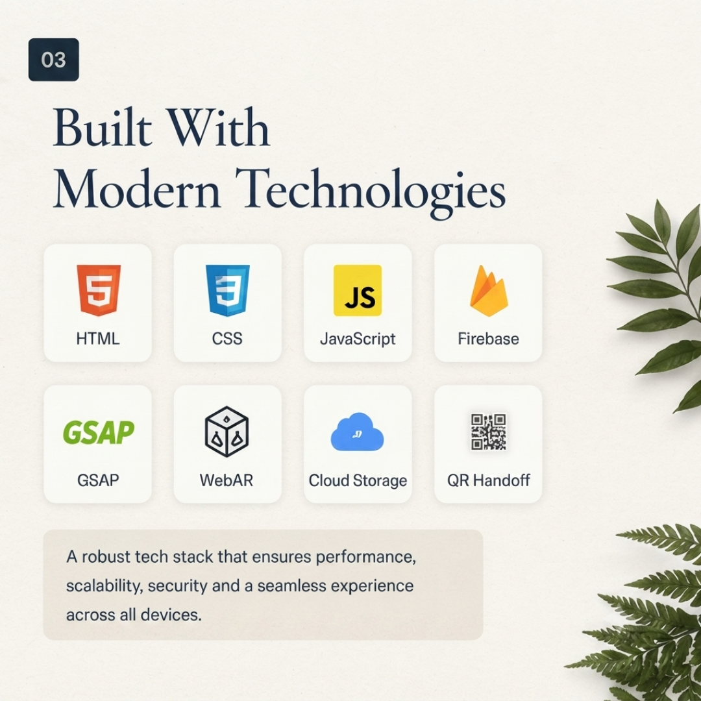
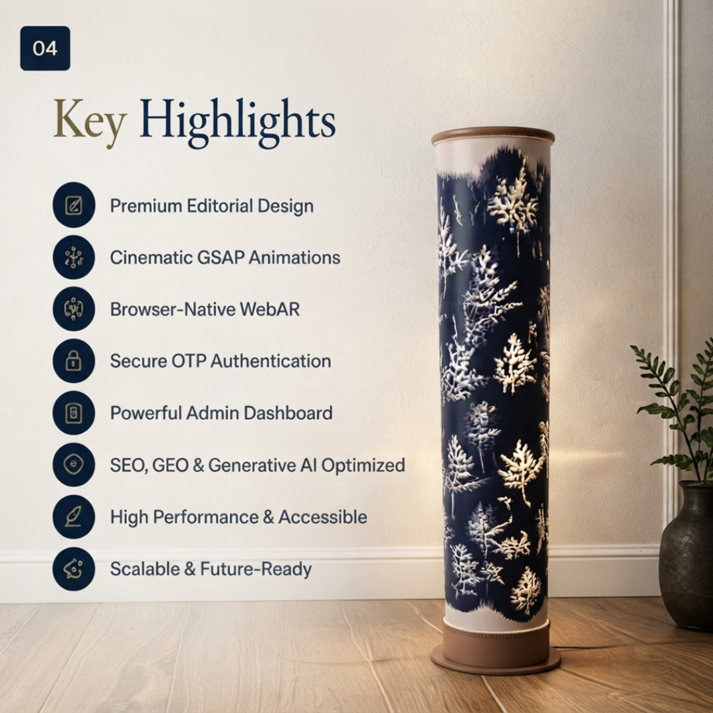
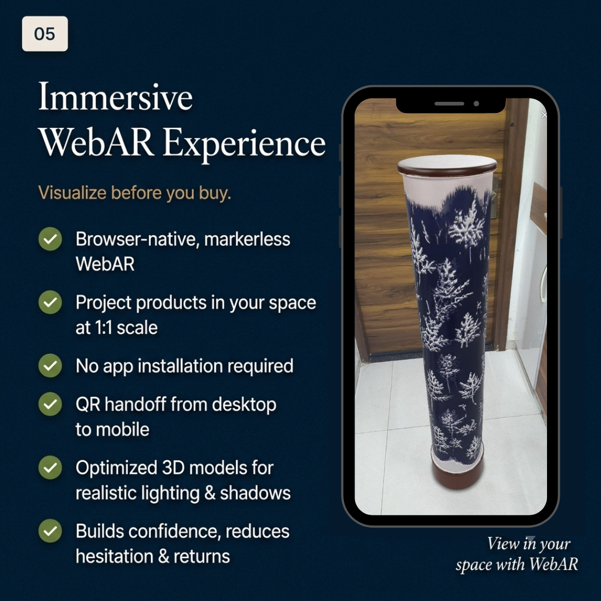
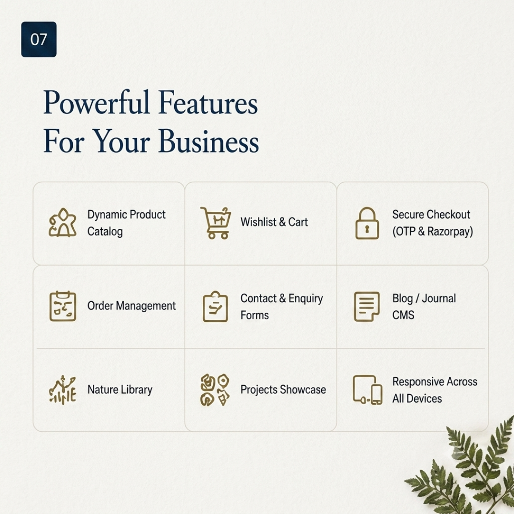
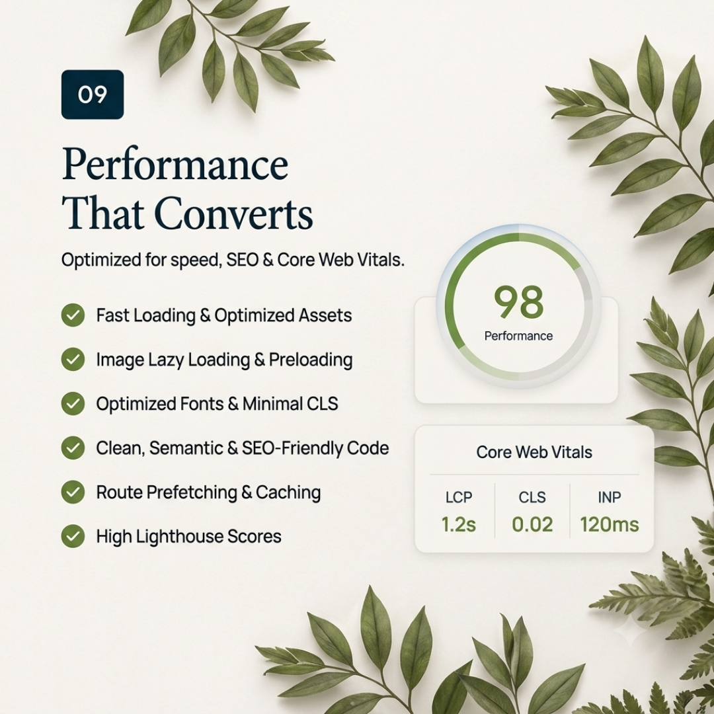
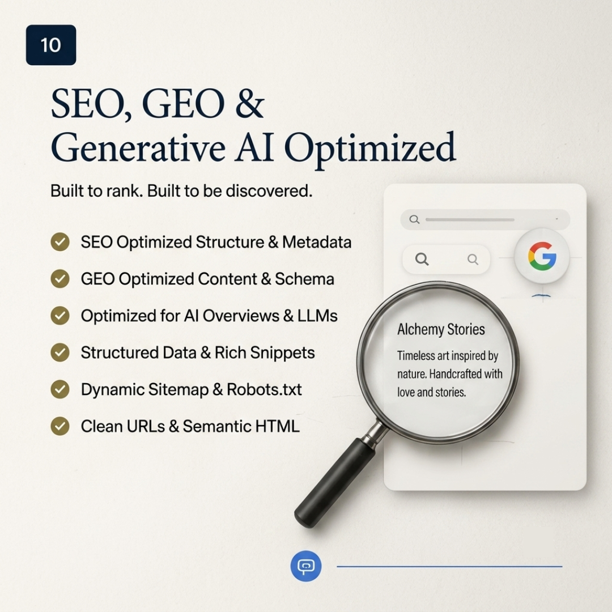
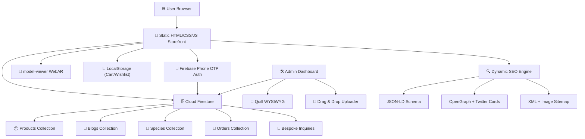

# 🌿 Alchemy Stories

> **Storytelling through art, with nature as our muse.**

A premium editorial eCommerce platform crafted for **Alchemy Stories**, a luxury handcrafted interior art brand specializing in **cyanotype artworks, botanical installations, nature-inspired home décor, and immersive storytelling**.

This project goes beyond a conventional online store by combining **cinematic storytelling, high-performance frontend engineering, browser-native WebAR, handcrafted interactions, and scalable serverless backend architecture** to create a memorable digital experience.

<p align="center">


</p>

---

## ✨ Live Preview

> **Live Website:** *[Click Here](https://alchermy-stories-deployed-version.vercel.app/)*

> **Case Study:** [Website Features Showcase](Website_Features_Showcase.md)

---

## 📸 Project Preview

| | |
| :---: | :---: |
|  |  |
|  |  |
|  |  |
|  |  |
|  |  |
|  |  |


---

## 📖 Table of Contents

- [Project Overview](#-project-overview)
- [Business Problem](#-business-problem)
- [Solution](#-solution)
- [Core Features](#-core-features)
  - [Premium Editorial Experience](#-premium-editorial-experience)
  - [Browser Native WebAR](#-browser-native-webar)
  - [Motion Design System](#-motion-design-system)
  - [Interactive Elements](#-interactive-elements)
- [Frontend Engineering](#-frontend-engineering)
- [Backend Engineering](#-backend-engineering)
- [Authentication](#-authentication)
- [Commerce Features](#-commerce-features)
- [Admin Dashboard](#-admin-dashboard)
- [Performance Engineering](#-performance-engineering)
- [Security](#-security)
- [Accessibility](#-accessibility)
- [SEO](#-seo)
- [Technology Stack](#-technology-stack)
- [System Architecture](#-system-architecture)
- [Project Structure](#-project-structure)
- [Installation](#-installation)
- [Environment Variables](#-environment-variables)
- [AI-Assisted Engineering Workflow](#-ai-assisted-engineering-workflow)
- [Future Roadmap](#-future-roadmap)
- [Engineering Learnings](#-engineering-learnings)
- [Acknowledgements](#-acknowledgements)
- [License](#-license)
- [Developer](#-developer)

---

## 🌱 Project Overview

Alchemy Stories is a luxury handcrafted art studio founded by **Reena Jasani** and **Kushan Jasani**, creating timeless artworks inspired by nature through the cyanotype printing process.

The objective of this project was to create a premium digital experience that reflects the brand's philosophy while enabling visitors to discover, visualize, and purchase handcrafted artworks seamlessly.

Unlike traditional eCommerce websites, this platform focuses on **storytelling before selling**, transforming every interaction into an immersive editorial experience.

---

## 💼 Business Problem

Traditional online stores often fail to communicate the emotional and artistic value of handcrafted products.

Challenges included:

- Luxury products appearing like ordinary catalogue items
- Difficulty visualizing handcrafted products inside real interiors
- Limited storytelling around collections and the cyanotype process
- Managing products, blogs, species entries, and projects without technical expertise
- Balancing immersive animations with performance and SEO
- Operating a storefront at zero infrastructure cost

---

## 💡 Solution

Designed and engineered a premium editorial website that combines:

- Luxury visual storytelling with editorial masonry layouts
- Browser-native WebAR product visualization with QR handoff
- Cinematic scroll-driven interactions and paper-folding animations
- Responsive editorial layouts across all standard devices
- Serverless Firebase backend architecture at $0/month OPEX
- Dynamic content management via a custom admin dashboard
- Secure phone OTP authentication with reCAPTCHA
- SEO-first implementation with dynamic JSON-LD, OpenGraph, and sitemaps

---

## 🚀 Core Features

### 🎨 Premium Editorial Experience

- **Curation-Focused Palette**: Deep cyanotype Prussian blue (`#173C7B`) contrasted with organic warm ivory/cream (`#FCFBF8`) and soft sage green (`#A9B89A`), evoking chemistry, nature, and interior design
- **Premium Typography**: **Cormorant Garamond** (elegant serif) for display headlines paired with **Manrope** (modern sans-serif) for readable body text, loaded via preconnected Google Fonts pipelines
- **Editorial Masonry Layouts**: Gallery grids and Nature Library logs implement varying heights and fluid spacing, mimicking physical art lookbooks instead of typical boxy storefronts
- **Minimalist User Interface**: Clean visual hierarchy with intentional whitespace, dashed borders, and muted color states

---

### 🌿 Browser Native WebAR

One of the signature features of the project.

Users can visualize handcrafted tower lamps directly inside their homes before purchasing.

#### Features

- **Markerless WebAR**: Integrated using Google's `<model-viewer>` library, allowing 1:1 scale product placement
- **Browser-Native Experience**: Runs natively inside Safari (AR Quick Look) and Android Chrome (WebXR Device API)
- **QR Handoff System**: Desktop users see a branded QR code with photo-corner framing; scanning opens the WebAR experience on mobile
- **Optimized GLB Assets**: 3D models optimized for fast loading while retaining soft lighting, reflections, and realistic shadows
- **No Application Installation Required**: Zero download barriers for the end user
- **Reduced Purchase Uncertainty**: Virtual placement of high-ticket items reduces hesitation and returns
- **Enhanced Buying Confidence**: Customers see exactly how a lamp looks in their living space before committing

---

### 🎬 Motion Design System

On this website, motion is not decorative — it is a communication tool that guides the user's focus and establishes brand prestige.

#### Highlights

- **Hardware-Accelerated Timings**: All transitions leverage CSS `transform` and `opacity` on the GPU, avoiding layout thrashing. Custom cubic-bezier formula (`cubic-bezier(0.16, 1, 0.3, 1)`) mimics natural physical momentum
- **Scroll-Driven Chemical Paper Folding**: The Alchemy Process section uses scroll-triggered transitions where visual frames representing the cyanotype paper fold and unfold, creating a cinematic narrative of the printmaking process
- **Micro-Interactions**: Hover states use subtle spring scale animations (`transform: scale(1.02)`) for immediate tactile feedback
- **GPU-Optimized Rendering**: All animations target compositor-only properties to maintain 60 FPS
- **Zero Layout Thrashing**: No width/height/top/left animations; exclusively transform and opacity based
- **Reduced Motion Support**: Respects `prefers-reduced-motion` user preferences

---

### ✨ Interactive Elements

- **Interactive Cart Sliding Drawer**: Smooth hardware-accelerated CSS transitions (`transition: transform var(--transition-medium)`) for instant item adjustments
- **Persistent Wishlist Badges**: Instant heart-toggles with reactive badge counter updates synced across all storefront pages
- **Scroll Animations (The Alchemy Process)**: Interactive paper-folding transition steps on the homepage using scroll-driven opacity and transform triggers
- **Custom Commission Modals**: Elegant overlay forms with transition sweeps for bespoke design requests
- **Product Thumbnail Switcher**: Click-to-swap image gallery with active state highlighting
- **Expandable Specification Accordions**: Animated content reveal panels for technical details, materials, and care guides

---

## 🖥️ Frontend Engineering

### User Experience Pages

| Page | File | Purpose |
|------|------|---------|
| **Home** | `index.html` | Hero experience, featured collections, alchemy process storytelling |
| **Collection** | `collection.html` | Filterable product catalog with category tabs |
| **Product** | `product.html` | Full product details, gallery, specs, WebAR, cart integration |
| **Nature Journal** | `journal.html` | Editorial blog listing page |
| **Blog Post** | `blog.html` | Individual article with rich content rendering |
| **Nature Library** | `library.html` | Species registry with botanical entries |
| **Projects** | `projects.html` | Custom installations and bespoke projects showcase |
| **About** | `about.html` | Brand story and founder profiles |
| **Contact** | `contact.html` | Inquiry form and studio information |
| **Wishlist** | `wishlist.html` | Saved products with persistent local storage |
| **Checkout** | `checkout.html` | Secure order placement with OTP verification |
| **Admin** | `admin.html` | Content management dashboard (protected) |

### UI Engineering

- **CSS Custom Properties Design System**: Centralized tokens for colors, spacing, typography, shadows, and transitions in `main.css`
- **Component-Driven Stylesheets**: Modular `components.css` for reusable cards, buttons, modals, and drawers
- **Page-Specific Layouts**: Dedicated `pages.css` for editorial grid systems and responsive overrides
- **Fluid Typography**: `clamp()` based scaling (e.g., `font-size: clamp(32px, 4vw, 48px)`)
- **CSS Variable Theming**: Entire palette and spacing controlled through `--primary`, `--secondary`, `--surface` tokens
- **Lazy-Loaded Media**: Browser-native `loading="lazy"` and `decoding="async"` on all below-the-fold images

---

## ⚙️ Backend Engineering

Serverless backend architecture powered by Firebase.

```
+---------------------------------------------------------------------------------+
|                               Firebase Services                                 |
+--------------------------+----------------------------+-------------------------+
|      Firestore DB        |    SMS Phone Verification  |     Firebase Hosting    |
| (NoSQL Real-Time Sync)   |    (reCAPTCHA + OTP token) |   (Free static hosting) |
+--------------------------+----------------------------+-------------------------+
```

### Features

- **Product Management**: Full CRUD operations for catalog items with images, descriptions, pricing, technical specifications, materials, and care guides
- **Dynamic Collections**: Category-based filtering and sorting across product types
- **Order Management**: Real-time order capture with customer details, delivery addresses, and order status
- **Bespoke Inquiries**: Custom design request submissions stored in Firestore
- **Blog Management**: Nature Journal articles with rich HTML content, cover images, and metadata
- **Species Library Management**: Botanical entries with scientific names, habitats, and conservation details
- **Real-Time Database Synchronization**: Firestore `onSnapshot` listeners for instant data updates across admin and storefront

### Why Serverless Firebase?

- **Zero OPEX**: Operates at **$0/month** baseline using Firebase free tiers (up to 10k phone verifications/month, generous database read/write quotas)
- **No Server Maintenance**: No virtual machines, container clusters, or database administration required
- **Non-Technical Handovers**: Client setup requires zero server configuration or DevOps knowledge
- **Built-In Scaling**: Firebase handles traffic spikes automatically without manual intervention

---

## 🔐 Authentication

Secure authentication system for the checkout flow:

- **Phone OTP Verification**: Two-step SMS authentication via Firebase Auth
- **Invisible reCAPTCHA**: Bot prevention integrated before OTP dispatch
- **Validation Guardrails**:
  - Alternating number scans prevent identical primary and backup phone submissions
  - OTP submission blocks trigger only upon successful inputs, preventing empty submissions from flooding API keys
- **Session Persistence**: Authentication state maintained across page navigation

### Customer Information Captured

- Full Name
- Primary Phone Number (OTP Verified)
- Email Address
- Delivery Address (Full)
- City, State, PIN Code
- Alternate Contact Number
- Special Instructions

---

## 🛍️ Commerce Features

The transaction engine is optimized to support high-value fine art purchases.

- **Transactional Cart Drawer**: Sliding overlay with smooth CSS transitions, cached in `localStorage` and synced on page load
- **Real-Time Cart Calculations**: Item increments, decrements, and deletions trigger immediate subtotal recalculations with global badge counter updates
- **Persistent Wishlist**: Heart-toggle wishlist synced across all storefront pages via `localStorage`
- **Dynamic Product Catalog**: Products loaded from both static fallback database and Firestore, merged without duplicates
- **Secure Checkout Flow**: Multi-field validated form with OTP verification gate
- **Duplicate Input Scanners**: Checkout logic blocks identical verification and alternative contact numbers
- **Order Confirmation**: Successful orders written to Firestore with full customer and cart metadata

---

## 🛠️ Admin Dashboard

Designed for non-technical administrators. The dashboard allows the client to manage all website content without developer intervention.

| Feature Area | Technology | Business Value |
|:---|:---|:---|
| **Realtime Orders Feed** | Firestore `onSnapshot` | Instant shipping coordination without page refreshes |
| **Bespoke Inquiries Inbox** | Firestore `onSnapshot` | Immediate lead response for custom designs |
| **Drag & Drop Uploaders** | HTML5 Drag & Drop + Base64 | Zero-config, hosting-free image handling |
| **Rich Text Editor** | Quill WYSIWYG | Full formatting (headers, tables, lists) without coding |
| **Catalog CRUD Modifiers** | Firestore Write Operations | Complete product, blog, and species management |

### Content Management

- **Products**: Add, edit, and delete catalog items with images, descriptions, pricing, technical specifications, materials & composition, and preservation & care guides
- **Nature Journal**: Full blog authoring with live split-screen preview and rich text formatting
- **Species Library**: Botanical entries with drag-and-drop image uploads
- **Projects**: Custom installation showcases with descriptions and gallery images
- **Orders & Inquiries**: Real-time feeds with auto-sync and manual refresh

### Rich WYSIWYG Editors

- **Full-Featured Quill Editor**: Customized toolbars with font styling, header hierarchies, bulleted/numbered lists, tables, and text formatting
- **Live Blog Split-Screen Canvas**: Input forms paired with responsive live storefront mockup for real-time article preview
- **Base64 Image Uploaders**: Drag-and-drop inputs converting raw images to Base64 data URLs, eliminating CDN configuration

### Additional Features

- **Dynamic Edit Sessions**: Full CRUD editing panels mapping Firestore attributes back into admin inputs, uploaders, and rich editors
- **Nesting UI Guardrail**: Built-in parenting scanner reparenting nested panel divs dynamically on load

---

## ⚡ Performance Engineering

Performance was considered from the beginning of development.

### Optimizations

- **Web Font Loading Pipeline**: Google Fonts loaded via parallel `<link>` preconnect channels instead of blocking CSS `@import` rules (~300ms saved on initial paint)
- **Above-The-Fold Preloading**: `<link rel="preload" as="image">` for hero banner assets to minimize LCP
- **Lazy Loading**: `loading="lazy"` and `decoding="async"` on all below-the-fold images
- **GPU-Only Animations**: All motion targets compositor-only CSS properties (`transform`, `opacity`)
- **Event Delegation**: Click interceptors bound to parent containers to minimize DOM event overhead
- **Minimal Layout Shifts**: Explicit dimension ratios declared on all image wrappers
- **Efficient DOM Sanitizers**: Lightweight inline sanitization functions instead of heavy library imports

### Targeted Core Web Vitals

| Metric | Target | Strategy |
|--------|--------|----------|
| **LCP** (Largest Contentful Paint) | < 1.5s | Hero image preloading, font preconnect |
| **CLS** (Cumulative Layout Shift) | 0 | Explicit image dimensions, stable layouts |
| **INP** (Interaction to Next Paint) | < 100ms | Event delegation, minimal handler overhead |

---

## 🔒 Security

Implemented production-ready security practices.

### Security Measures

- **Stored XSS Protections**: HTML escaping utility (`escapeHTML`) converts all user inputs into safe string literals before DOM rendering in admin workspace
- **Client-Side DOM Sanitizers**: Custom `sanitizeHTML()` functions strip `<script>` tags, `javascript:` protocol schemas, and event handlers (`onload`, `onerror`) from dynamically loaded Firestore content
- **Firestore Security Rules**: Role-based access controls blocking unauthorized writes on public collections while protecting private customer data
- **Input Validation**: Multi-layer form validation preventing empty submissions, duplicate entries, and malformed data
- **Environment Variable Isolation**: Firebase configuration excluded from version control via `.gitignore`
- **reCAPTCHA Bot Prevention**: Invisible reCAPTCHA verification before SMS OTP dispatch

---

## ♿ Accessibility

Built with accessibility as a core requirement.

### Features

- **Semantic HTML**: Proper use of `<header>`, `<nav>`, `<main>`, `<section>`, `<article>`, `<footer>` elements
- **ARIA Labels**: Explicit descriptive labels on interactive elements (`aria-label="Remove from wishlist"`, `aria-expanded="false"`)
- **Keyboard Navigation**: Drawers, menus, and modals navigable via Tab and dismissible with Escape
- **Focus Indicators**: Visible focus states on all interactive elements
- **High Contrast Ratios**: Color values passing WCAG AA standards
- **Descriptive Alt Text**: Contextual `alt` attributes on all image elements
- **Responsive Typography**: Fluid `clamp()` based font scaling for readability across devices

### Responsive Viewport Support

| Device | Viewport | Behavior |
|--------|----------|----------|
| **Laptop L** | 1440px+ | Multi-column editorial grid, premium spacing |
| **Laptop S** | 1024px – 1439px | Fluid column scaling, clamp-based typography |
| **Tablet** | 768px – 1023px | 4→2 column transition, mobile menu toggle |
| **Mobile L** | 425px – 767px | Single column stack, slide-in bottom sheets |
| **Mobile M** | 375px – 424px | Compact layout, large 48×48px tap targets |
| **Mobile S** | 320px – 374px | Minimal layout, optimized touch interaction |

---

## 🔍 SEO

The website is optimized for search engines from the ground up.

### SEO Features

| Feature | Implementation |
|---------|---------------|
| **Semantic HTML** | Proper heading hierarchy, landmark elements |
| **Metadata** | Dynamic `<title>` and `<meta description>` per page |
| **Open Graph** | Dynamic `og:title`, `og:description`, `og:image` injection |
| **Twitter Cards** | `summary_large_image` cards with dynamic content |
| **Canonical URLs** | Dynamic `<link rel="canonical">` preventing duplicate indexing |
| **JSON-LD Structured Data** | `Product` schema (name, price, availability) and `BlogPosting` schema |
| **XML Sitemap** | `sitemap.xml` indexing all static pages and dynamic product/blog URLs |
| **Image Sitemap** | Google Image namespace (`xmlns:image`) for premium art photo indexing |
| **Heading Hierarchy** | Single `<h1>` per page with logical `H1 → H2 → H3` structure |
| **Descriptive Alt Text** | Contextual alt attributes on all product and editorial images |
| **Clean URL Structure** | Query parameter based routing (`?id=product-slug`) |

---

## 🏗️ Technology Stack

| Layer | Technology |
|-------|------------|
| **Structure** | HTML5 (Semantic) |
| **Styling** | CSS3 (Custom Properties, Flexbox, Grid) |
| **Logic** | JavaScript (ES6+, Vanilla) |
| **Backend** | Firebase (Serverless BaaS) |
| **Database** | Cloud Firestore (NoSQL Real-Time) |
| **Authentication** | Firebase Auth (Phone OTP + reCAPTCHA) |
| **Rich Text Editing** | Quill.js (WYSIWYG) |
| **WebAR** | Google model-viewer (WebXR / Scene Viewer / AR Quick Look) |
| **3D Assets** | GLB Format (Optimized) |
| **Icons** | Lucide Icons |
| **QR Generation** | QR Server API |
| **Fonts** | Google Fonts (Cormorant Garamond + Manrope) |
| **Deployment** | Netlify / Vercel / GitHub Pages |

---

## 🧩 System Architecture



---

## 📁 Project Structure

```
alchemy-stories/
│
├── index.html                  # Home page — hero, collections, alchemy process
├── collection.html             # Filterable product catalog
├── product.html                # Product detail page with WebAR
├── journal.html                # Nature Journal blog listing
├── blog.html                   # Individual blog post
├── library.html                # Nature species registry
├── projects.html               # Custom installations showcase
├── about.html                  # Brand story and founders
├── contact.html                # Inquiry form
├── wishlist.html               # Saved products
├── checkout.html               # Secure checkout with OTP
├── admin.html                  # Admin content management dashboard
├── sitemap.xml                 # XML + Image sitemap for SEO
├── .gitignore                  # Git ignore rules
├── Website_Features_Showcase.md # Detailed case study document
│
├── assets/
│   ├── css/
│   │   ├── main.css            # Design system tokens and base styles
│   │   ├── components.css      # Reusable component styles
│   │   └── pages.css           # Page-specific layouts and responsive rules
│   │
│   ├── js/
│   │   ├── firebase-config.js          # Firebase credentials (gitignored)
│   │   ├── firebase-config-example.js  # Template for Firebase setup
│   │   ├── main.js             # Central product catalog, cart, wishlist engine
│   │   ├── home.js             # Homepage animations and scroll interactions
│   │   ├── product.js          # Product page rendering, WebAR, SEO injection
│   │   ├── collections.js      # Collection filtering and catalog display
│   │   ├── blog.js             # Blog post rendering and SEO injection
│   │   ├── blog-data.js        # Static blog content fallback
│   │   ├── journal.js          # Journal listing page logic
│   │   ├── checkout.js         # Checkout form validation and OTP flow
│   │   └── admin.js            # Admin dashboard CRUD, Quill editors, uploaders
│   │
│   ├── *.png                   # Product images, hero banners, brand assets
│   └── *.glb                   # Optimized 3D models for WebAR
│
└── README.md
```

---

## 🚀 Installation

**Clone the repository**

```bash
git clone https://github.com/rajshahdev966/Alchemy-Stories-Full-Stack-Website.git
```

**Move into the project**

```bash
cd Alchemy-Stories-Full-Stack-Website
```

**Set up Firebase configuration**

```bash
cp assets/js/firebase-config-example.js assets/js/firebase-config.js
```

Then edit `assets/js/firebase-config.js` and replace the placeholder values with your Firebase project credentials.

**Run with any local server**

Since this is a static site, you can use any local development server:

```bash
# Using Python
python -m http.server 8000

# Using Node.js (npx)
npx serve .

# Using VS Code Live Server extension
# Right-click index.html → "Open with Live Server"
```

---

## 🔑 Environment Variables

This project uses a local JavaScript configuration file instead of `.env` variables.

**Copy the example file:**

```bash
cp assets/js/firebase-config-example.js assets/js/firebase-config.js
```

**Fill in your Firebase credentials:**

```javascript
const firebaseConfig = {
  apiKey: "YOUR_API_KEY",
  authDomain: "YOUR_PROJECT_ID.firebaseapp.com",
  projectId: "YOUR_PROJECT_ID",
  storageBucket: "YOUR_PROJECT_ID.firebasestorage.app",
  messagingSenderId: "YOUR_MESSAGING_SENDER_ID",
  appId: "YOUR_APP_ID"
};
```

> ⚠️ **Note:** The `firebase-config.js` file is excluded from version control via `.gitignore`. Never commit your actual credentials to a public repository.

---

## 🤖 AI-Assisted Engineering Workflow

The development of this platform leveraged a cooperative pair-programming model between developer and AI, optimizing each phase of the project:

```
AI-Assisted Workflow
        ↓
Requirements Breakdown
        ↓
Architecture Planning
        ↓
Component Scaffolding
        ↓
Animation Prototyping
        ↓
Code Review
        ↓
Security Audit
        ↓
Documentation
```

| Phase | What AI Helped With |
|-------|---------------------|
| **Requirements Breakdown** | Translated business curation ideas (editorial designs, printmaking processes) into technical criteria (masonry cards, scroll animations, database schemas) |
| **Architecture Planning** | Chose serverless Firebase client-side architecture over heavy database clusters to achieve $0/month baseline costs |
| **Component Scaffolding** | Built clean storefront loops, sliding drawers, and admin forms using standard JS and CSS variables |
| **Animation Prototyping** | Structured high-performance GPU scroll-driven calculations for the paper-folding cyanotype animation |
| **Code Review** | Resolved asynchronous timing issues (like wishlist page loading race conditions) by designing custom lifecycle events (`productsLoaded`) |
| **Security Audit** | Audited variables for database XSS vulnerabilities, adding character filters and sanitizer utilities on all injection points |
| **Documentation** | Generated technical blueprints, verification steps, and search index files (`sitemap.xml`) |

---

## 🛣️ Future Roadmap

- [ ] AI-powered artwork recommendations
- [ ] Customer account dashboard with order history
- [ ] Inventory management system
- [ ] Shipping tracking integration
- [ ] Multi-language support
- [ ] Advanced analytics dashboard
- [ ] Wishlist cloud synchronization (cross-device)
- [ ] Personalized collections based on browsing history
- [ ] Full-text collection search
- [ ] Progressive Web App (PWA) support
- [ ] Payment gateway integration (Razorpay / Stripe)
- [ ] Email notification system for orders

---

## 🎯 Engineering Learnings

This project provided valuable experience in:

- Designing **storytelling-driven user experiences** instead of conventional product catalogues
- Engineering **cinematic scroll interactions** while maintaining strong Core Web Vitals
- Building **reusable editorial design systems** using CSS Custom Properties
- Integrating **browser-native WebAR** into an eCommerce workflow with QR handoff
- Creating **scalable content management architecture** for non-technical users
- Balancing **immersive animations with accessibility and SEO**
- Implementing **production security** (XSS sanitizers, input validation, reCAPTCHA) on a static site
- Achieving **zero-cost serverless architecture** using Firebase free tiers

---

## 🙏 Acknowledgements

Special thanks to the founders of **Alchemy Stories** for inspiring a project centered around nature, storytelling, and handcrafted artistry.

---

## 📄 License

This project is created for portfolio and educational showcase purposes.

All artwork, branding, and creative assets belong to **Alchemy Stories**.

The source code may not be reused for commercial purposes without permission.

---

## 👨‍💻 Developer

**Raj Shah**

Premium Frontend Engineer • UI/UX Designer • Full Stack Developer

> Building immersive digital experiences that combine engineering, storytelling, and performance.

[](https://github.com/rajshahdev966)

---

<p align="center">

⭐ If you found this project inspiring, consider giving this repository a star.

</p>
